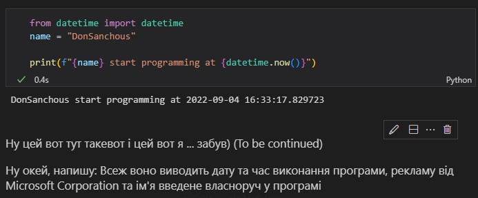

# Звіт до роботи
## Тема: Оформлення та здача робіт
### Мета роботи: навчитись оформляти та здавати роботи 
---
### Виконання роботи :finnadie:

- Друга програма на пітоні:

```Python
from datetime import datetime
name = "DonSanchous"

print(f"{name} start programming at {datetime.now()}")
```
Результат виконання програми: :flushed:
```
DonSanchous start programming at 2022-09-04 15:49:19.605884
```

- Створив новий файл з розширенням .ipynb (:flushed:)

Результат виконання програми: :sunglasses:
```
DonSanchous start programming at 2022-09-04 15:49:19.605884
```
Після натиску на Run All нічого не змінилося :corn:



### Висновок: під час виконання даної лабораторної роботи я навчився формувати звіт і написав другу свою програму на Пітхоні. (Колись настане час і я зможу розказати чому програма не перша а Друга :flushed:)
> у висновку потрібно відповісти на запитання:
- :question: Що зроблено в роботі; створено прогу і перевірено 
- :question: Чи досягнуто мети роботи; Yes
- :question: Які нові знання отримано; Ci
- :question: Чи вдалось відповісти на всі питання задані в ході роботи; No
- :question: Чи вдалося виконати всі завдання; Yes
- :question: Чи виникли складності у виконанні завдання; звісно, можете побачити по результам того що програма видала (там між ними 30 хв різниці)
- :question: Чи подобається такий формат здачі роботи (Feedback); Завжди мріяв (нє)
- :question: Побажання для покращення (Suggestions); го в майн зіграємо, будете для мене ресурси приносити, а я в свою чергу добудую вулицю в Італійському стилі
---